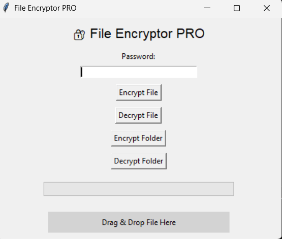

# 🔐 Secure File Encryption System (Intermediate Level)

A **GUI-based desktop application** for encrypting and decrypting files using **AES-256 encryption**. This project demonstrates **password-based file security**, **desktop GUI development**, and packaging Python applications into a standalone executable.

---

## 💻 Features

* GUI-based application using **Tkinter**
* **AES-256 encryption** for secure file protection
* Password-based file encryption & decryption
* Encrypt and decrypt files easily via simple interface
* Standalone desktop application using **PyInstaller**
* Portable and easy-to-use on Windows PC

---

## 🛠 Technologies Used

* Python 3.x
* Tkinter (GUI)
* Cryptography (AES-256 encryption)
* PyInstaller (for building `.exe`)

---

## ⚙️ How to Run

1. Clone the repository:

```bash
git clone https://github.com/BipronathSaha12/secure-file-encryptor.git
cd secure-file-encryptor
```

2. Install dependencies:

```bash
pip install -r requirements.txt
```

3. Run the app:

```bash
python main.py
```

4. (Optional) Build standalone executable:

```bash
pyinstaller --onefile --windowed main.py
```

---

## 📂 How It Works

1. User selects a file to encrypt or decrypt.
2. User enters a password for protection.
3. The application uses **AES-256** to encrypt or decrypt the file.
4. Encrypted files are saved with a `.enc` extension.
5. Decrypted files are restored to their original content.

---


## 🚀 Future Enhancements

* Add **PBKDF2/Argon2 key derivation** for improved security
* Add **login system** for user authentication
* Add **file history dashboard** and file management
* Integrate with **cloud storage** (Google Drive, AWS S3)
* Convert to **Django web app** for web interface

---

## 📷 Screenshots




---

## ⚖ License

This project is open-source under the [MIT License](https://github.com/BipronathSaha12/secure-file-encryptor/blob/master/LICENSE).

